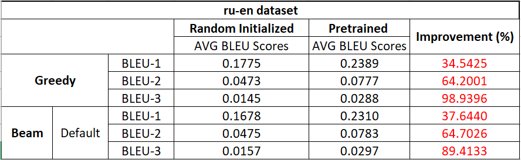

# Translation-with-attention-GRU
 Machine Translation with attention-based GRU   
 Conduct comprehensive study and tuning on different parts of the attention-based GRU architecture.   

## Dataset

 A multilingual parallel dataset from ACL 2014 NINTH WORKSHOP ON STATISTICAL MACHINE TRANSLATION is used in this project. In particular, the News Commentary category is used. There are in total 4 language pairs in this dataset and all are bidirectional:    

•	CS-EN     
•	DE-EN      
•	FR-EN      
•	RU-EN 

In this project, all 4 language pairs' performances will be examined, but English will always be fixed as the target language to predict.   
More information about the dataset can be found here: http://www.statmt.org/wmt14/translation-task.html#download      

## Experiment Setup

All the experiments below will be based on the BLEU scores evaluated from the nltk.translate.bleu_score's corpus_bleu() function. BLEU scores generated from this function are typically decimal values all smaller than 1. Each training session takes 75000 iterations.    

### Experiment 1: Compare the model performance between the greedy decoding and beam search decoding

In this section, the greedy decoding performance will be used as the comparison baseline, which is clearer to see whether switching to beam search decoding actually improves the performance or not.   
In terms of the beam search decoding setup, the stopping criterion adopted here is the number of completed hypotheses collected. On top of that, there're some tweaks to the specific detailed settings:   

•	**Default setting**: Apply length normalization when calculating each hypothesis score and No limitation on the max sequence length   
•	**N MAX L**:  Apply length normalization when calculating each hypothesis score but there's a limitation on the max sequence length   
•	**NO N NO MAX L**:  Not apply length normalization when calculating each hypothesis score and there's a limitation on the max sequence length    

The four language pairs' results are shown as followed:      

### Experiment 2: Compare the model performance between random initialized embedding and pretrained embedding layer

The loaded embedding layer is pretrained by Word2Vec from gensim.models package. The pretraining data is monolingual training data which can be downloaded from the link: http://www.statmt.org/wmt14/translation-task.html#download.   

The comparison results are:   

### Experiment 3: Compare the model performance between different attention mechanisms
In details, besides the default dot-product attention mechanism, two other attention variants are also being examined:   

The comparison results are:

   
